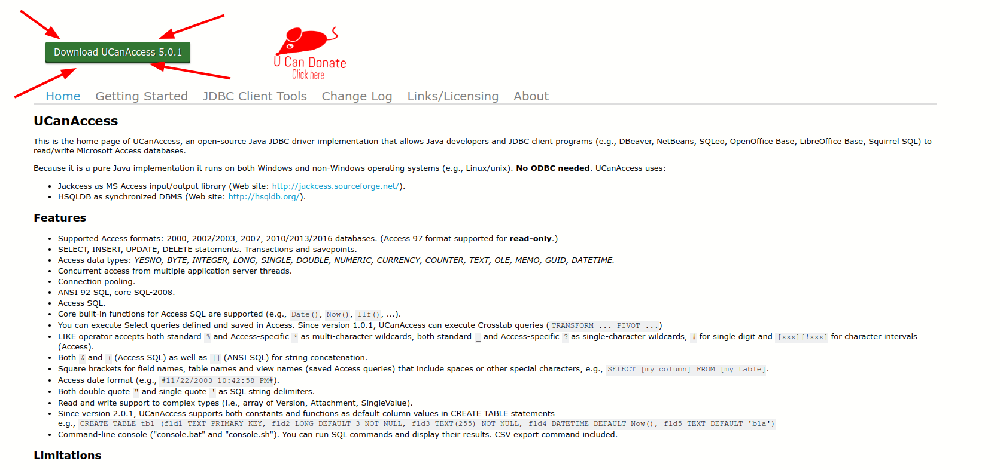
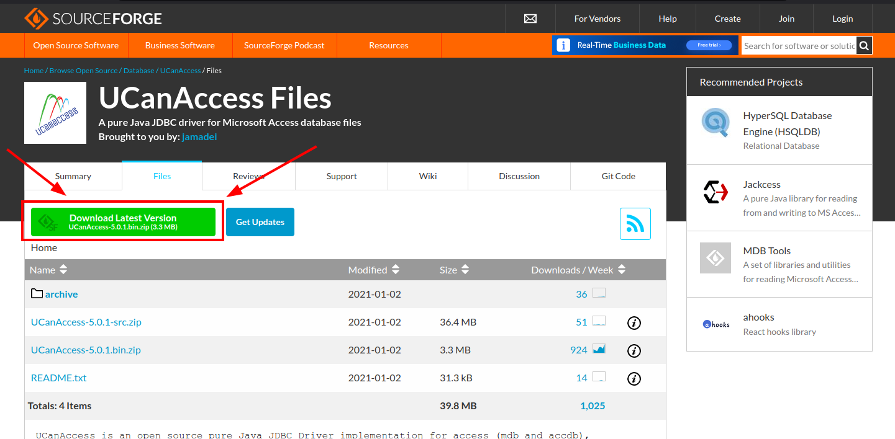
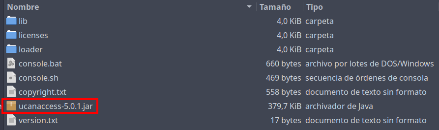
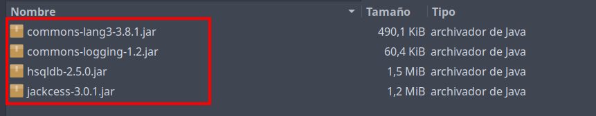

# Acceder a una base de datos en Access usando Java
Link de descarga: [ucanaccess](https://ucanaccess.sourceforge.net/site.html)

## Hacer en click en Download/Descargar

## Hacer en click en Descargar última versión

## Una vez descargado el archivo comprimido, proceder a extraer el mismo y copiar los archivos .jar de la carpeta lib y también el archivo ucanaccess-5.0.1.jar.

## Pegar estos archivos a la carpeta lib del proyecto de java